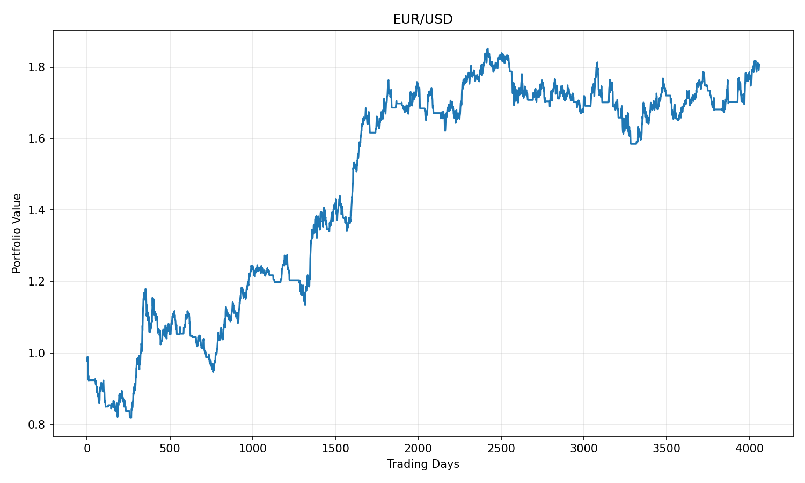
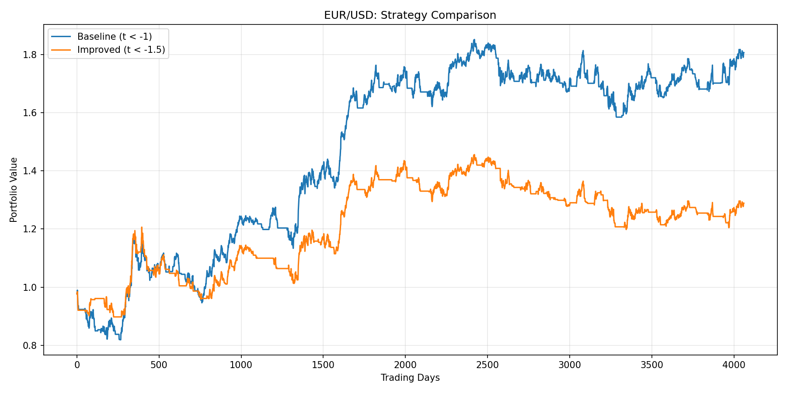
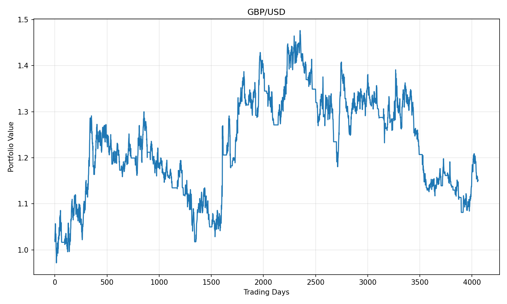
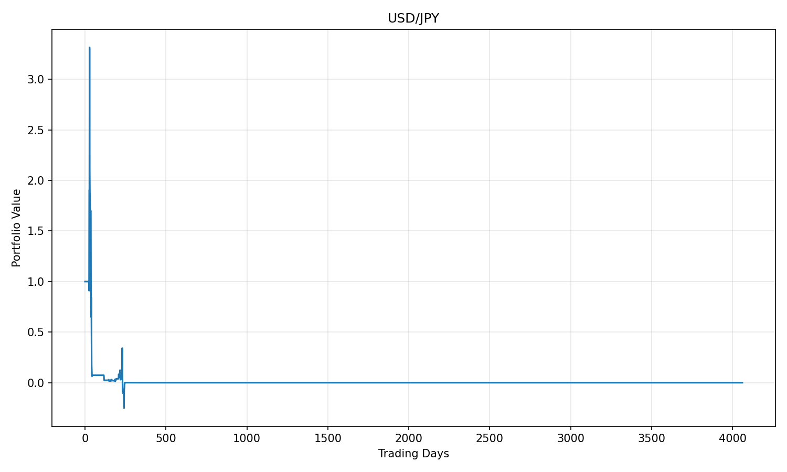

# Mean Reversion Trading Strategy

## Quick Start

```bash
# 1. Setup environment
python -m venv venv
.\venv\Scripts\activate          # Windows
source venv/bin/activate         # Mac/Linux

# 2. Install dependencies
pip install -r requirements.txt

# 3. Run strategy
python mean_reversion_strategy.py
```

## Project Structure

```
├── data/                         # Inputs: Currency CSV files
│   ├── eurusd_data.csv
│   ├── gbpusd_data.csv
│   └── usdjpy_data.csv
├── mean_reversion_strategy.py    # Main strategy code
├── requirements.txt              # Dependencies
└── outputs/                      # Generated charts
    ├── baseline_performance.png
    ├── strategy_comparison.png
    ├── gbpusd_performance.png
    └── usdjpy_performance.png
```

## Results

### EUR/USD Performance

The EUR/USD pair shows strong mean reversion characteristics with clear statistical significance.

**Mean Reversion Test:**
- Alpha: 0.002613, Beta: -0.002259
- t-statistic: -2.53
- Signal: **Detected** ✓

**Baseline Strategy (t < -1):**
- Sharpe Ratio: 0.029
- Trading Activity: 3057/4061 days (75.3%)
- Win Rate: 52.1%
- Max Drawdown: -19.80%



**Improved Strategy (t < -1.5):**
- Sharpe Ratio: 0.016
- Trading Activity: 2253/4061 days (55.5%)
- Win Rate: 51.4%
- Max Drawdown: -20.58%



### GBP/USD Performance

The GBP/USD pair demonstrates moderate mean reversion behavior.

**Mean Reversion Test:**
- Alpha: 0.002052, Beta: -0.001510
- t-statistic: -1.90
- Signal: **Detected** ✓

**Strategy Results:**
- Sharpe Ratio: 0.009
- Trading Activity: 3184/4061 days (78.4%)
- Win Rate: 49.8%
- Max Drawdown: -26.76%



### USD/JPY Performance

**Warning:** USD/JPY shows weak mean reversion signals and should be traded with caution.

**Mean Reversion Test:**
- Alpha: 0.025309, Beta: -0.000089
- t-statistic: -0.18
- Signal: **NOT TRADEABLE** ✗

**Strategy Results:**
- Sharpe Ratio: -0.020 (negative)
- Trading Activity: 1418/4061 days (34.9%)
- Win Rate: 48.9%
- Max Drawdown: -107.59%



### Key Findings

1. **EUR/USD** is the most suitable pair for this mean reversion strategy, showing the strongest statistical signal and positive Sharpe ratio.
2. **GBP/USD** shows moderate performance with a low but positive Sharpe ratio.
3. **USD/JPY** does not exhibit sufficient mean reversion behavior and resulted in significant losses - avoid trading this pair with this strategy.
4. The baseline strategy (t < -1) performs better than the stricter threshold (t < -1.5) for EUR/USD, suggesting that a moderate threshold is optimal.

